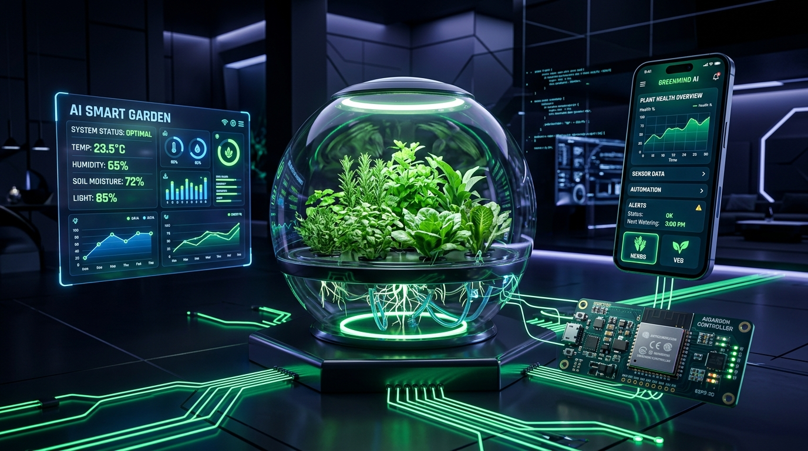
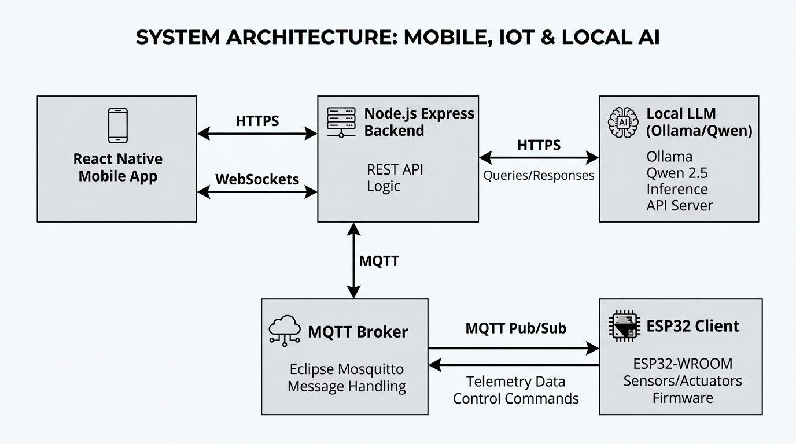
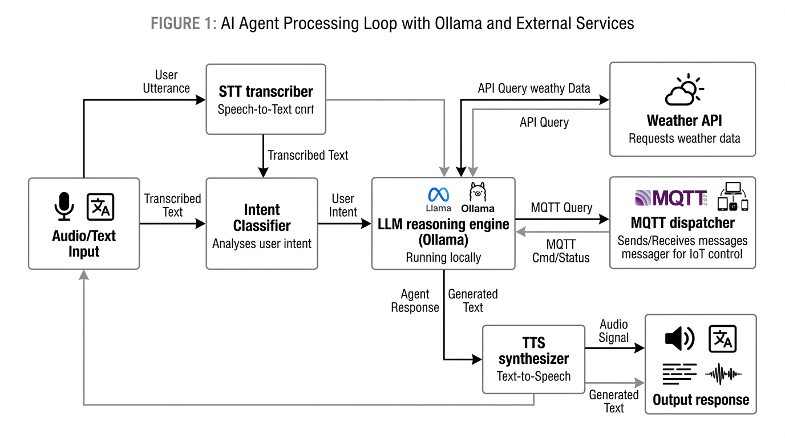
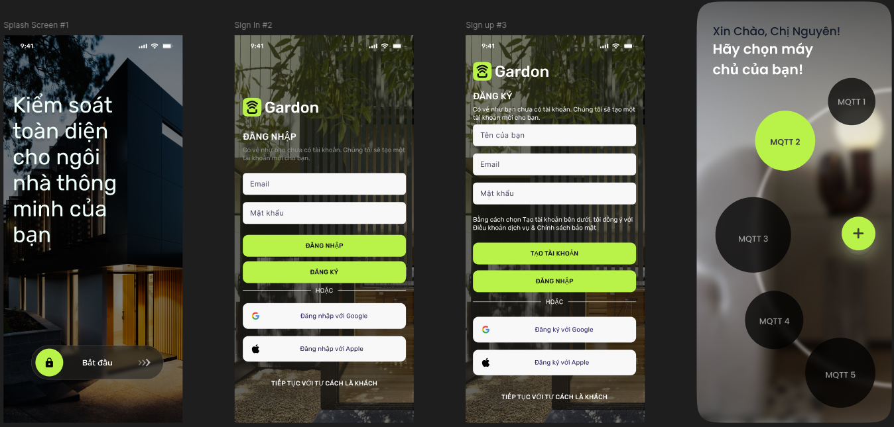
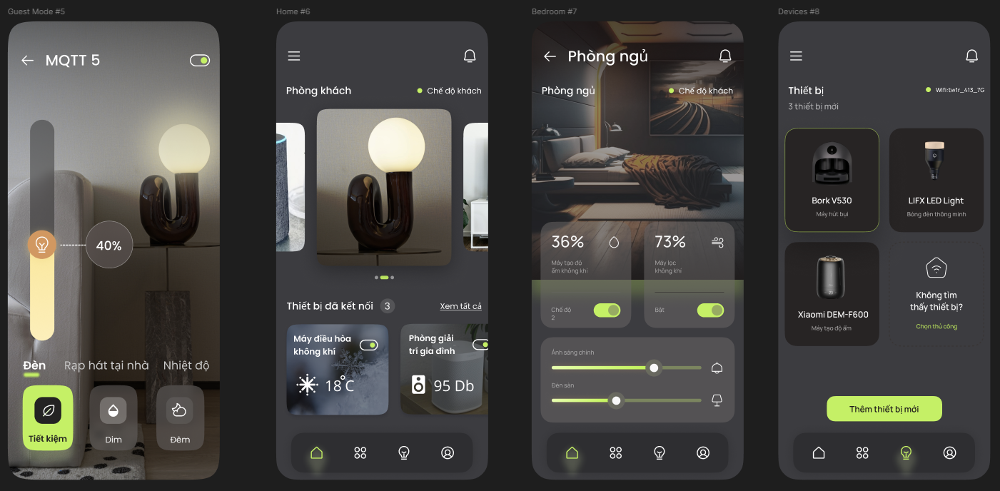
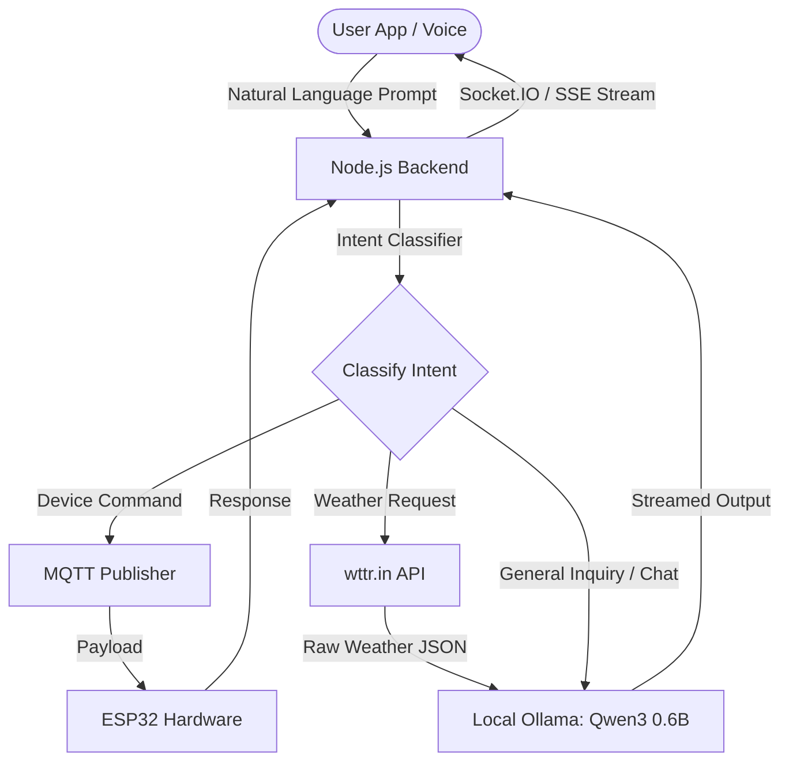

# 🌿 Gardon SmartThinks: AI-Powered Smart Garden IoT Platform

> [!IMPORTANT]
> **Commercial Archive & Academic Support Notice**
> This project was once developed for commercial purposes and deployed for paying customers, generating revenue for the team. However, active commercial development and operations concluded approximately 1 year ago. It is no longer utilized for commercial operations, and the technologies, configurations, or dependencies may be outdated. All current maintenance and repository activities are strictly dedicated to archiving, academic research, and community learning support.

---

## 📸 Media & Visuals

Here are the visual concepts, architectural designs, and mobile interfaces of the **Gardon SmartThinks** ecosystem:

### 🌟 Project Concept Visual



### 🔌 Physical & Logical IoT System Architecture


### 🧠 AI Cognitive Orchestration Loop


### 📱 Main User Interface



### 🎥 Demo Video

<div align="center">

<video src="https://github.com/user-attachments/assets/71ddfdce-e5fe-4c1b-bba1-ce17c8925c04" width="850" controls>
 Your browser does not support the video tag.
</video>

<br />

<a href="https://github.com/user-attachments/assets/71ddfdce-e5fe-4c1b-bba1-ce17c8925c04">
 Watch demo video
</a>

</div>

<br />

A full-length video demonstration is archived in the repository. You can watch/download it here: [demo.mp4](demo/demo.mp4).

---

## 📝 Project Overview

**Gardon SmartThinks** is an advanced, production-grade IoT ecosystem designed for smart garden monitoring and home automation. It combines microcontrollers, standard web dashboards, a cross-platform mobile application, and a local **AI/LLM Agent** featuring Voice Control (STT/TTS) to deliver a seamless, interactive smart home experience.

### 🌟 Key Core Systems
1.  **AI Voice & Chatbot Assistant ("LyLy AI")**: A local LLM-powered smart assistant that interprets natural Vietnamese/English language commands, queries real-time conditions, summarizes weather data, and triggers IoT actions.
2.  **Cross-Platform Mobile App (Expo)**: Built using React Native, providing real-time device control, customizable widget layouts, interactive voice/text chatbot, and built-in peer-to-peer WebRTC video/voice calls.
3.  **Vite + React Web Dashboard**: A web-based configuration center allowing users to manage MQTT broker connections, subscribe to topics, and send low-level test payloads.
4.  **Express.js IoT Backend**: The centralized hub handling user authentication, device metadata management, social features, MQTT event streaming, and local LLM coordination.
5.  **ESP32 Firmware**: Written for both Arduino IDE (MQTT LED/Relay control) and ESP-IDF (BLE Wifi Provisioning).

---

## 🧠 AI Features & Orchestration

The AI capabilities in **Gardon SmartThinks** go beyond simple keyword matching. The system features a cognitive loop that orchestrates requests between the mobile UI, backend services, and a local LLM.



### 1. Natural Language Intent Parsing & Dispatching
When a user inputs a query (via text or voice), the backend parses the input to determine the user's intent:
*   **IoT Control Intent**: Detects action verbs (turn on, switch off, toggle) and device nouns (light, fan, pump). It maps these to MQTT topics (e.g. `/esp32/led/gpio22`) and publishes commands directly to the ESP32.
*   **Weather Intent**: Detects queries about the climate or forecasts. The server fetches raw weather data from `wttr.in` and feeds it into the LLM together with a specific system prompt to generate a friendly, natural Vietnamese/English summary.
*   **General Chat Intent**: Routes the conversation history (up to 10 context messages) directly to the local LLM.

### 2. Local LLM Integration (Ollama)
The system is built to support local model execution via **Ollama**, ensuring complete data privacy and offline capability. By default, it targets the ultra-lightweight `qwen3:0.6b` model.
*   **System Prompting**: Employs role-specific prompts configuring the assistant as **"LyLy AI"**, a friendly family assistant for the owners.
*   **Response Streaming**: Leverages Server-Sent Events (SSE) or WebSockets to stream the LLM's response chunk-by-chunk to the React Native app, rendering the text in real-time as it is generated.

### 3. Voice Interaction Loop (STT / TTS)
The `llm-agent` Python component manages the audio loop:
*   **Speech-to-Text (STT)**: Transcribes voice inputs from the mobile app microphone into text.
*   **Text-to-Speech (TTS)**: Converts the AI's generated response into natural speech (`.mp3`), playing it back to the user or streaming the audio bytes.

---

## 📂 Repository Structure

The workspace has been organized into a clean monorepo architecture:

```text
├── backend/               # Main Node.js Backend Server (IoT, Auth, WebRTC, Database)
├── mobile-app/            # Expo React Native App (UI, Dashboard, Chat, WebRTC Calling)
├── web-app/               # Vite React + TS Dashboard (MQTT testing web panel)
│   └── backend/           # Lightweight helper backend for the web panel
├── llm-agent/             # Python Ollama STT/TTS Agent (Speech scripts, Docker configs)
├── firmware/              # ESP32 Device Codes
│   ├── esp32-arduino/     # Arduino IDE MQTT Client (.ino)
│   └── esp32-idf-prov/    # ESP-IDF Bluetooth WiFi Provisioning
├── docs/                  # Technical guidelines, backups, and reports
└── demo/                  # Demo media files (images and video)
```

---

## 🛠️ Tech Stack & Technologies

### Mobile Application
*   **React Native & Expo**: Cross-platform mobile development framework.
*   **React Native WebRTC**: Real-time peer-to-peer audio and video calling.
*   **Socket.IO Client**: Persistent full-duplex socket connections.
*   **Expo Camera & AV**: For video calls and voice audio recording.

### Backend Server
*   **Node.js & Express**: Extensible REST API backend.
*   **Mongoose (MongoDB)**: Object Data Modeling for user profiles, device logs, and chat sessions.
*   **Socket.IO**: Real-time bi-directional event communication.
*   **MQTT.js**: Client library to connect the backend to the MQTT broker.

### Web Dashboard
*   **Vite, React 19, TypeScript**: Fast, type-safe web dashboard development.
*   **Socket.IO Client & MQTT**: For real-time topic subscriptions and interface testing.

### Firmware & Hardware
*   **ESP32 DevKit v1**: Wi-Fi and Bluetooth-enabled microcontroller.
*   **PubSubClient**: MQTT client library for Arduino.
*   **WiFiProvisioning**: BLE-based Wi-Fi credential setup via ESP-IDF.

---

## 🚀 Quick Start & Installation

### 1. Main Backend Setup
```bash
cd backend
# 1. Install dependencies
npm install
# 2. Configure .env (provide MONGODB_URI, OLLAMA_BASE_URL, and ACCESS_TOKEN)
# 3. Start the server
npm run dev
```

### 2. Mobile App Setup
```bash
cd mobile-app
# 1. Install dependencies
npm install
# 2. Configure .env with your backend IP address
# 3. Start Expo packager
npm start
```

### 3. LLM Agent (Ollama)
```bash
cd llm-agent
# Start Ollama via docker-compose
docker-compose up -d
# Download the lightweight model
docker exec -it ollama ollama run qwen3:0.6b
```

### 4. Web Control Panel
```bash
cd web-app
# 1. Install dependencies
npm run install:all
# 2. Start both web panel and its basic backend
npm run start:full
```

---

## 📄 License
This project is shared under the **MIT License**. Feel free to use, modify, and distribute it for academic or personal learning purposes.
