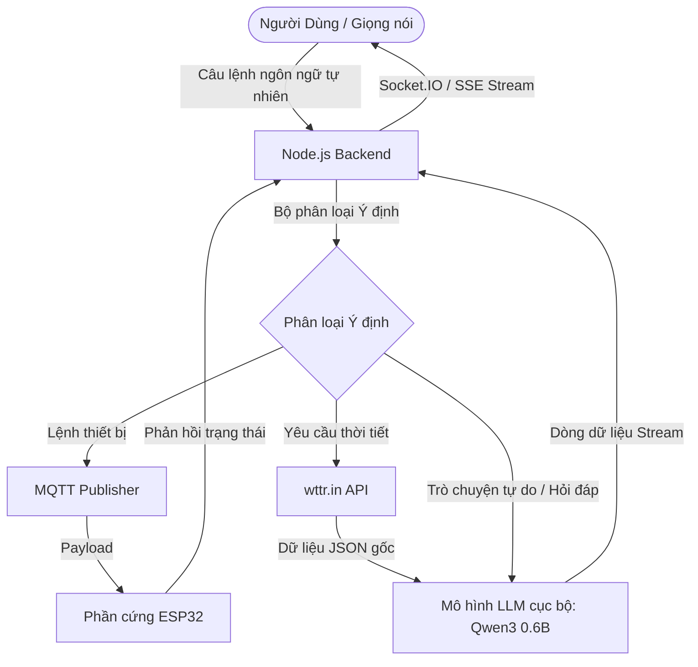

# 🌿 Gardon SmartThinks: Nền Tảng IoT Sân Vườn Thông Minh Tích Hợp Trí Tuệ Nhân Tạo (AI)

> [!IMPORTANT]
> **Thông báo lưu trữ thương mại & Hỗ trợ học thuật**
> Dự án này từng được dùng cho mục đích thương mại và được lắp đặt thực tế cho các khách hàng có nhu cầu, tạo ra nguồn lợi nhuận cho đội ngũ phát triển. Tuy nhiên, dự án đã chính thức kết thúc hoạt động thương mại khoảng 1 năm trước. Hiện tại, nó không còn được sử dụng cho mục đích thương mại và mọi công nghệ, thư viện hay cấu hình có thể đã lỗi thời. Tất cả nỗ lực duy trì mã nguồn hiện tại chỉ nhằm mục đích lưu trữ, nghiên cứu học thuật và hỗ trợ cộng đồng cùng học tập.

---

## 📸 Hình ảnh & Video Minh Họa

Dưới đây là hình ảnh ý tưởng hệ thống và giao diện ứng dụng di động của hệ sinh thái **Gardon SmartThinks**:

### 🧠 Mô hình Khái niệm & Kiến trúc AI


### 📱 Giao diện Ứng dụng Di động


### 🎥 Video Demo Thực Tế

<div align="center">

<video src="https://github.com/user-attachments/assets/71ddfdce-e5fe-4c1b-bba1-ce17c8925c04" width="850" controls>
 Trình duyệt của bạn không hỗ trợ thẻ video.
</video>

<br />

<a href="https://github.com/user-attachments/assets/71ddfdce-e5fe-4c1b-bba1-ce17c8925c04">
 Xem video demo
</a>

</div>

<br />

Video chạy thử nghiệm hệ thống thực tế đã được lưu trữ trong kho lưu trữ này. Bạn có thể xem hoặc tải xuống tại đây: [demo.mp4](demo/demo.mp4).

---

## 📝 Giới Thiệu Dự Án

**Gardon SmartThinks** là một hệ sinh thái IoT hoàn chỉnh phục vụ cho việc giám sát sân vườn và tự động hóa gia đình thông minh. Dự án tích hợp các thiết bị vi điều khiển phần cứng, bảng điều khiển web, ứng dụng di động đa nền tảng và một **AI/LLM Agent** cục bộ hỗ trợ giao tiếp qua giọng nói (STT/TTS) để mang lại trải nghiệm điều khiển nhà thông minh tự nhiên nhất.

### 🌟 Các Phân Hệ Chính
1.  **Trợ Lý Ảo Giọng Nói AI ("LyLy AI")**: Trợ lý thông minh sử dụng mô hình LLM chạy cục bộ, có khả năng hiểu các câu lệnh tiếng Việt tự nhiên, truy vấn trạng thái thiết bị, tóm tắt thời tiết và thực thi các kịch bản IoT.
2.  **Ứng dụng Mobile (Expo)**: Viết bằng React Native, cung cấp giao diện giám sát thời gian thực, tùy biến widget, khung chat AI trực quan, và hỗ trợ gọi Video/Audio trực tiếp qua giao thức ngang hàng WebRTC.
3.  **Bảng Điều Khiển Web (Vite + React)**: Trung tâm cấu hình kết nối MQTT broker, hỗ trợ subscribe các topic và gửi payload test trực tiếp từ trình duyệt.
4.  **Máy chủ IoT Backend (Express.js)**: Trung tâm xử lý xác thực người dùng, lưu trữ thông tin thiết bị, mạng xã hội, luồng dữ liệu MQTT và điều phối các yêu cầu AI.
5.  **Mã nguồn Firmware ESP32**: Bao gồm mã nguồn Arduino IDE (điều khiển LED/Relay qua MQTT) và ESP-IDF (Cấu hình Wifi thông qua Bluetooth BLE Provisioning).

---

## 🧠 Tích Hợp & Điều Phối Trí Tuệ Nhân Tạo (AI)

Tính năng AI trong **Gardon SmartThinks** không đơn thuần chỉ là so khớp từ khóa cố định, mà được thiết kế dưới dạng một chu trình nhận thức (cognitive loop) kết nối giữa ứng dụng Mobile, Backend và AI Agent chạy cục bộ.



### 1. Phân Loại Ý Định Tự Nhiên (Intent Parsing & Dispatching)
Khi người dùng nhập văn bản hoặc ra lệnh bằng giọng nói, backend sẽ phân tích cú pháp câu lệnh để xác định ý định:
*   **Ý định điều khiển IoT (IoT Control)**: Nhận diện các động từ hành động (bật, tắt, đổi trạng thái) và danh từ thiết bị (đèn, quạt, máy bơm). Hệ thống tự động chuyển đổi sang topic MQTT tương ứng (ví dụ: `/esp32/led/gpio22`) và phát lệnh nạp trực tiếp cho ESP32.
*   **Ý định thời tiết (Weather)**: Khi người dùng hỏi về nhiệt độ ngoài trời hoặc thời tiết hôm nay. Server tự động gọi API từ `wttr.in`, lấy dữ liệu thô dạng JSON và nạp vào LLM cùng với system prompt chuyên biệt để sinh ra bản tóm tắt thời tiết tự nhiên, ngắn gọn và có kèm khuyến nghị.
*   **Ý định trò chuyện chung (General Chat)**: Hệ thống sẽ chuyển tiếp nội dung kèm theo lịch sử trò chuyện (tối đa 10 tin nhắn gần nhất) trực tiếp đến mô hình ngôn ngữ lớn cục bộ.

### 2. Tích Hợp Mô Hình LLM Cục Bộ (Ollama)
Để đảm bảo quyền riêng tư dữ liệu tuyệt đối và khả năng hoạt động offline, dự án sử dụng **Ollama** để chạy các mô hình nội bộ. Mặc định hệ thống hướng tới mô hình siêu nhẹ `qwen3:0.6b` hoạt động mượt mà trên phần cứng máy chủ gia đình.
*   **Thiết lập System Prompt**: Nạp các prompt định hình tính cách cho trợ lý ảo lấy tên là **"LyLy AI"** - trợ lý thân thiện của gia đình.
*   **Phản hồi Streaming**: Sử dụng Server-Sent Events (SSE) hoặc WebSocket để truyền tải nội dung phản hồi từ LLM về App Mobile dưới dạng từng mảnh từ (chunk-by-chunk), giúp hiển thị chữ chạy theo thời gian thực (real-time stream).

### 3. Giao Tiếp Giọng Nói (STT / TTS)
Module `llm-agent` viết bằng Python đóng vai trò cầu nối xử lý âm thanh:
*   **Speech-to-Text (STT)**: Chuyển đổi giọng nói của người dùng thu âm từ Micro trên App điện thoại thành văn bản.
*   **Text-to-Speech (TTS)**: Nhận kết quả văn bản từ AI để chuyển đổi thành tệp tin âm thanh nói tự nhiên dạng `.mp3` và phát ngược lại cho người dùng.

---

## 📂 Cấu Trúc Thư Mục Dự Án

Thư mục đã được tái cấu trúc sạch sẽ theo mô hình monorepo thống nhất:

```text
├── backend/               # Server Express chính (IoT, Auth, WebRTC, Database)
├── mobile-app/            # Ứng dụng Expo React Native (Giao diện, Dashboard, Chat, WebRTC Calling)
├── web-app/               # Bảng điều khiển Vite React + TS (Dùng test MQTT và gửi topic)
│   └── backend/           # Server backend phụ trợ tối giản phục vụ cho trang web
├── llm-agent/             # Python Ollama STT/TTS Agent (Kịch bản âm thanh, cấu hình Docker)
├── firmware/              # Mã nguồn thiết bị ESP32
│   ├── esp32-arduino/     # Code Arduino IDE kết nối MQTT (.ino)
│   └── esp32-idf-prov/    # Code ESP-IDF cấu hình Wifi qua Bluetooth BLE
├── docs/                  # Các tài liệu phân tích kỹ thuật, báo cáo và bản lưu trữ
└── demo/                  # Các file media minh họa (Video demo và hình ảnh)
```

---

## 🛠️ Công Nghệ Sử Dụng (Tech Stack)

### Ứng dụng Di động (Mobile App)
*   **React Native & Expo**: Phát triển ứng dụng di động đa nền tảng.
*   **React Native WebRTC**: Thiết lập cuộc gọi video và giọng nói thời gian thực.
*   **Socket.IO Client**: Duy trì kết nối socket liên tục.
*   **Expo Camera & AV**: Xử lý camera cho cuộc gọi video và micro cho ghi âm giọng nói.

### Máy chủ Backend
*   **Node.js & Express**: Thiết lập REST API.
*   **Mongoose (MongoDB)**: Quản lý thông tin người dùng, nhật ký thiết bị và phiên chat.
*   **Socket.IO**: Giao tiếp sự kiện hai chiều thời gian thực.
*   **MQTT.js**: Thư viện kết nối server với MQTT broker.

### Giao Diện Web (Web Dashboard)
*   **Vite, React 19, TypeScript**: Tối ưu tốc độ tải trang và kiểm soát kiểu dữ liệu an toàn.
*   **Socket.IO Client & MQTT**: Đăng ký nhận bản tin topic và test thiết bị.

### Phần cứng & Firmware
*   **ESP32 DevKit v1**: Chip vi điều khiển tích hợp Wifi và Bluetooth.
*   **PubSubClient**: Thư viện client MQTT cho Arduino.
*   **WiFiProvisioning**: Cơ chế cấu hình Wifi thông qua Bluetooth BLE của ESP-IDF.

---

## 🚀 Hướng Dẫn Cài Đặt & Chạy Nhanh

### 1. Khởi động Backend chính
```bash
cd backend
# 1. Cài đặt các thư viện phụ thuộc
npm install
# 2. Tạo file .env (Điền MONGODB_URI, OLLAMA_BASE_URL, và ACCESS_TOKEN)
# 3. Khởi chạy ở chế độ dev
npm run dev
```

### 2. Khởi động Ứng dụng Mobile
```bash
cd mobile-app
# 1. Cài đặt thư viện
npm install
# 2. Cập nhật IP backend vào cấu hình .env
# 3. Chạy trình đóng gói Expo
npm start
```

### 3. Cài đặt LLM Agent (Ollama)
```bash
cd llm-agent
# Khởi chạy Ollama qua docker-compose
docker-compose up -d
# Tải mô hình Qwen3 siêu nhẹ
docker exec -it ollama ollama run qwen3:0.6b
```

### 4. Khởi động Bảng điều khiển Web
```bash
cd web-app
# 1. Cài đặt toàn bộ thư viện cho cả web và backend phụ trợ
npm run install:all
# 2. Khởi động đồng thời web dashboard và backend phụ trợ
npm run start:full
```

---

## 📄 Bản Quyền (License)
Dự án được chia sẻ dưới giấy phép **MIT License**. Bạn có thể thoải mái sử dụng, chỉnh sửa và chia sẻ mã nguồn này cho mục đích học tập cá nhân hoặc nghiên cứu học thuật.
