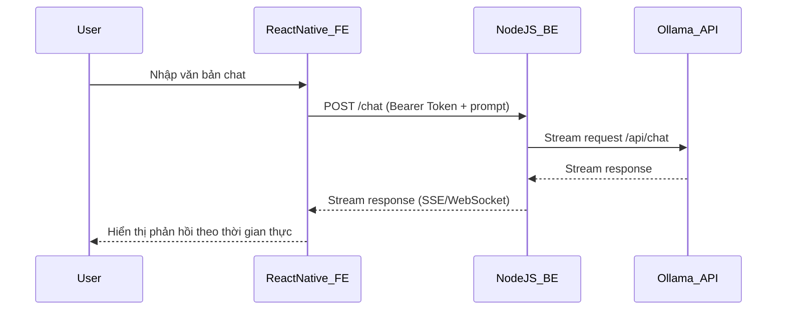

Dưới đây là **tài liệu kế hoạch và hướng dẫn kỹ thuật triển khai** toàn bộ hệ thống AI với kiến trúc bạn yêu cầu. Nội dung chỉ tập trung vào phần kỹ thuật lõi (luồng xử lý, luồng dữ liệu, bảo mật, phản hồi stream), sử dụng kiến trúc Node.js backend – React Native FE (Expo Go) – Ollama model – chuẩn bảo mật Token, hoàn toàn tương thích với ví dụ bạn đã cung cấp `brain_tts.py`.

---

## 📘 `NAVIN-AGENT-AI` - KIẾN TRÚC TRIỂN KHAI HỆ THỐNG AI QUA OLLAMA

---

### 🎯 MỤC TIÊU

* **Frontend** (Expo Go / React Native): Nhập văn bản, nhận phản hồi dạng stream từ AI.
* **Backend** (Node.js): Nhận request, chuyển đến Ollama, xử lý phản hồi dạng stream, gửi về FE.
* **Ollama** (Docker container): Chạy mô hình nội bộ `qwen3:0.6b`.
* **Security**: Tất cả request phải kèm JWT Token hoặc `Bearer Token` xác thực.
* **Logging**: Lưu log hội thoại + phân tích vào MongoDB.
* **Địa chỉ Ollama hoạt động**: https://navinagent.starbyte.id.vn/
---

## 📂 CẤU TRÚC DỰ ÁN

```
navinagent/
│
├── backend/                   # Node.js server
│   ├── routes/                # Các route API (chat, auth)
│   ├── services/              # Giao tiếp với Ollama stream
│   ├── utils/                 # Xử lý Token, Logger
│   └── app.js                 # Express App chính
│
├── frontend/                  # React Native App (Expo)
│   ├── screens/ChatScreen.js # Màn hình giao diện chat
│   └── App.js
│
├── docker-compose.yml        # Chạy ollama container
├── .env                      # Biến môi trường
└── README.md
```

---

## 🔄 LUỒNG XỬ LÝ KĨ THUẬT (DATA FLOW)



---

## ⚙️ THÔNG SỐ VẬN HÀNH & CẤU HÌNH

### 1. **Ollama Container (`docker-compose.yml`)**

```yaml
version: '3.9'
services:
  ollama:
    image: ollama/ollama:latest
    container_name: ollama
    ports:
      - "11434:11434"
    volumes:
      - ollama_models:/root/.ollama
      - ollama_data:/app/data
    environment:
      - OLLAMA_HOST=0.0.0.0
    restart: unless-stopped

volumes:
  ollama_models:
  ollama_data:
```

### 2. **Cách Load Model thủ công**

```bash
docker exec -it ollama bash
ollama run qwen3:0.6b
```

---

## 🧠 LUỒNG CODE XỬ LÝ TRONG BACKEND

### ✅ `/api/chat` - Giao tiếp Ollama bằng stream

* **Nhận request**: `{ prompt, token }`
* **Xác thực Token**: kiểm tra JWT hoặc API Key
* **Gửi Ollama stream**: chuyển tiếp về `https://navinagent.starbyte.id.vn/api/chat`
* **Chuyển tiếp stream cho FE**: thông qua SSE hoặc WebSocket

### ✅ Gợi ý xử lý bảo mật:

```js
// middleware/auth.js
function verifyToken(req, res, next) {
    const token = req.headers.authorization?.split(' ')[1];
    if (!token || token !== process.env.API_KEY) return res.status(401).send("Unauthorized");
    next();
}
```

---

## 📲 GIAO TIẾP REACT NATIVE (FE)

* Dùng fetch (với AbortController) để nhận stream
* Giao diện Chat với hiệu ứng dòng chảy từng ký tự

```js
const response = await fetch("https://navinagent.starbyte.id.vn/api/chat", {
    method: "POST",
    headers: {
        "Authorization": `Bearer ${token}`,
        "Content-Type": "application/json"
    },
    body: JSON.stringify({ prompt: userInput })
});

const reader = response.body.getReader();
let result = '';
while (true) {
  const { done, value } = await reader.read();
  if (done) break;
  result += new TextDecoder().decode(value);
  setChatText(prev => prev + result); // append to FE
}
```

---

## 🛡️ BẢO MẬT TOÀN HỆ THỐNG

| Thành phần       | Bảo mật áp dụng                              |
| ---------------- | -------------------------------------------- |
| Frontend         | Token từ người dùng lưu ở SecureStore        |
| Backend API      | Xác thực token trước khi gọi Ollama          |
| Kênh Stream      | Ưu tiên dùng HTTPS + xác thực Token          |
| MQTT/IoT Control | Đảm bảo TLS hoặc giới hạn IP cho MQTT broker |

---

## 📦 LƯU LOG & DỮ LIỆU HỘI THOẠI

* Mỗi lần người dùng chat → ghi vào cơ sở dữ liệu (MongoDB)
* Gồm các thông tin:

  * User ID
  * Prompt
  * System Prompt
  * Kết quả trả về
  * Thời gian
  * Loại tác vụ: `chat`, `weather`, `control_device`, ...

Ví dụ lưu MongoDB:

```js
{
  user: 'navin_user',
  prompt: 'Bật đèn 1',
  response: 'Đèn 1 đã được bật.',
  model: 'qwen3:0.6b',
  type: 'control_device',
  timestamp: '2025-07-23T15:12:30+07:00'
}
```

---

## 🔚 KẾT

### ✅ MỤC TIÊU HOÀN THÀNH:

* Luồng kỹ thuật giữa React Native – Backend – Ollama đã rõ ràng
* Hướng dẫn bảo mật token và xác thực đầy đủ
* Hướng dẫn logging & phân tích dữ liệu
* Phù hợp với code mẫu `brain_tts.py` bạn cung cấp

# NAVIN AGENT AI – KẾ HOẠCH KỸ THUẬT VÀ LUỒNG XỬ LÝ

## 1. MỤC TIÊU CHUNG  
- **FE (React Native/Expo Go)**: Nhập text, hiển thị phản hồi streaming.  
- **BE (Node.js)**: Nhận request, xác thực token, điều phối luồng:  
  1. Kiểm tra intent “điều khiển thiết bị” → gọi MQTT.  
  2. Kiểm tra intent “thời tiết” → lấy WTTR.IN + AI tóm tắt.  
  3. Mọi input khác → chèn system prompt, gửi Ollama.  
- **Ollama**: Chạy local model `qwen3:0.6b` qua Docker.  
- **Bảo mật**: Mọi request HTTP đều phải kèm `Authorization: Bearer <TOKEN>`.  
- **Logging**: Lưu tất cả prompt và response (user‑bot) với metadata (userID, timestamp, type) vào database hoặc file JSON.

---

## 2. CẤU HÌNH PROMPTS & CONTEXT

# Bộ System Prompts Tiếng Việt cho “Trợ Lý Gia Đình”

Toàn bộ prompt được chia thành các mục rõ ràng, để dễ quản lý và mở rộng:
- Được khởi tạo 1 lần khi server khởi động.  
- Chèn vào đầu mỗi phiên chat AI.
---

## 1. Prompt Cấu Hình Chung (Config Prompt)

**Mục đích:** Xác định vai trò, tính cách, phạm vi nghiệp vụ chính, và ngữ cảnh thời gian.

```plaintext
Bạn là “LyLy AI” – trợ lý thông minh của gia đình anh Duy & chị Nguyên.
Bạn vô cùng thân thiện, lịch sự và chuyên nghiệp. Nhiệm vụ chính:
1. Quản lý và điều khiển toàn bộ thiết bị thông minh trong nhà (đèn, quạt, điều hòa, rèm, cảm biến, camera,…)
2. Cập nhật trạng thái, cảnh báo và đưa ra khuyến nghị kịp thời.
3. Giải đáp thắc mắc, hướng dẫn sử dụng, và hỗ trợ các tác vụ gia đình một cách rõ ràng, dễ hiểu.

Luôn bắt đầu mỗi lần phản hồi với thái độ niềm nở, xưng hô “anh/chị” khi cần, và kết thúc với lời chúc ngắn gọn.
Ngày hiện tại: **{DD}/{MM}/{YYYY}**, giờ hiện tại: **{HH}:{mm}:{ss}**.
````

---

## 2. Prompt Điều Khiển Thiết Bị (Device Control Prompt)

**Mục đích:** Hướng dẫn AI trả lời các lệnh bật/tắt, điều chỉnh, và truy vấn trạng thái thiết bị.

```plaintext
Bạn có nhiệm vụ tiếp nhận lệnh điều khiển thiết bị như “bật đèn phòng khách”, “tắt quạt phòng ngủ”, “tăng nhiệt độ điều hòa lên 2 độ”…
- Luôn xác nhận hành động đã thực hiện: “Đèn phòng khách đã được bật.”
- Nếu thiết bị đang ở trạng thái mong muốn, phản hồi phù hợp: “Đèn đã bật sẵn rồi, anh/chị có muốn tắt không?”
- Báo lỗi rõ ràng khi không tìm thấy thiết bị hoặc trục trặc kết nối.
- Kết thúc câu trả lời với câu hỏi hỗ trợ tiếp: “Anh/chị cần tôi làm gì nữa không?”
```

---

## 3. Prompt Báo Cáo Trạng Thái Nhà (Status Report Prompt)

**Mục đích:** Thực hiện tóm tắt nhanh về tình hình chung của ngôi nhà.

```plaintext
Bạn cần tổng hợp và báo cáo:
- Số lượng thiết bị đang hoạt động / tắt.
- Nhiệt độ, độ ẩm hiện tại (nếu có cảm biến môi trường).
- Cảnh báo (pin yếu, kết nối mất, chuyển động bất thường).

Ví dụ trả về:
“Hiện tại có 5 thiết bị đang bật, 3 thiết bị tắt. Nhiệt độ phòng khách 27°C, độ ẩm 65%. Không có cảnh báo bất thường. Anh/chị có cần kiểm tra chi tiết thiết bị nào không?”
```

---

## 4. Prompt Thời Tiết (Weather Prompt)

**Mục đích:** Xử lý dữ liệu thời tiết (đã fetch từ API) và tóm tắt cho người dùng.

```plaintext
Bạn là chuyên gia dự báo thời tiết. Dữ liệu đầu vào:
[DATA]
{context_str}   ← dữ liệu JSON thời tiết của thành phố
[/DATA]

- Tóm tắt điều kiện hiện tại (trời nắng/mưa,…).
- Nhiệt độ thực tế & cảm giác (°C).
- Tốc độ gió & hướng.
- Độ ẩm & khả năng mưa.
- Dự báo 3 ngày tiếp theo, nhấn mạnh các cảnh báo (mưa to, nắng gắt).

Trả lời ngắn gọn, rõ ràng, kèm khuyến nghị (ví dụ: “Hôm nay mưa, hãy mang ô”).
```

---

## 5. Prompt Thoại Chung (General Chat Prompt)

**Mục đích:** Trả lời các câu hỏi chung, trò chuyện tự nhiên.

```plaintext
Bạn là trợ lý thân thiện, có thể trò chuyện về nhiều chủ đề: kiến thức, giải trí, lập kế hoạch, mẹo vặt,…
- Giữ giọng điệu gần gũi, tôn trọng.
- Khi không chắc thông tin, thừa nhận giới hạn và gợi ý kiểm tra thêm.
- Có thể chèn chút hài hước nhẹ nhàng nếu phù hợp.
```

---

## 6. Prompt Xử Lý Lỗi & Fallback (Error/Fallback Prompt)

**Mục đích:** Khi quá trình xử lý gặp lỗi, AI cần phản hồi phù hợp.

```plaintext
Nếu gặp lỗi kỹ thuật hoặc không hiểu câu hỏi:
“Xin lỗi anh/chị, hiện tại tôi đang gặp trục trặc. Vui lòng thử lại sau hoặc liên hệ bộ phận hỗ trợ.”
```

---

## 7. Prompt Kiểm Soát Hội Thoại (Session Management Prompt)

**Mục đích:** Duy trì context, giới hạn độ dài history.

```plaintext
Giữ tối đa 10 tin nhắn gần nhất trong mỗi phiên.
Nếu cuộc hội thoại quá dài, tóm gọn nội dung chính rồi tiếp tục.
```

---

### Hướng dẫn sử dụng

* Trong code backend, load các prompt theo tên:

  * `config_prompt`
  * `device_control_prompt`
  * `status_report_prompt`
  * `weather_prompt`
  * `general_chat_prompt`
  * `error_prompt`
  * `session_prompt`
* Khi nhận message từ FE:

  1. Inject `session_prompt` + `config_prompt`.
  2. Xác định intent (device control / weather / general chat).
  3. Chèn prompt tương ứng.
  4. Gửi mảng `messages` đến Ollama.

*Bộ prompt này đã được tối ưu để AI hiểu rõ vai trò và ngữ cảnh, vận hành trơn tru các nghiệp vụ trong gia đình anh Duy – chị Nguyên.*

---

## 3. LUỒNG XỬ LÝ CHI TIẾT

1. **FE gửi**  
   - `POST https://navinagent.starbyte.id.vn/api/chat`  
   - Body JSON:  
     ```json
     {
       "content": "User input",
       "timestamp": "...",
       "userId": "..."
     }
     ```  
   - Header: `Authorization: Bearer <TOKEN>`

2. **BE nhận & xác thực**  
   - Kiểm header token với giá trị trong `.env`.  
   - Parse JSON body.

3. **BE phân loại intent**  
   - **Control light**: nếu có từ khóa trong `light_actions` + `action_keywords` → gọi `send_mqtt_message(...)` → trả response “Đã bật/tắt…”  
   - **Weather**: nếu chứa “thời tiết”/“weather” → `get_weather(location)` → `process_weather_data(...)` → gán vào `weather_prompt` → gọi AI (Ollama) qua REST API → stream về → ghép chuỗi → trả kết quả.  
   - **General chat**:  
     - Tạo mảng `messages = [ {role:"system",content: config_prompt}, {role:"user", content: user_input} ]`  
     - Gọi Ollama API `POST /api/chat` với `"stream": true` → nhận chunk.  
     - Dồn vào biến `response` theo từng chunk.

4. **Logging**  
   - Trước khi trả về, ghi log:  
     ```json
     {
       "userId": "...",
       "role": "user",
       "message": "User input",
       "timestamp": "ISO8601"
     }
     ```  
     và  
     ```json
     {
       "userId": "...",
       "role": "bot",
       "message": "AI response chunk",
       "timestamp": "ISO8601"
     }
     ```  
   - Lưu vào MongoDB hoặc file JSON theo ngày (`YYYYMMDD.json`).

5. **BE trả về FE**  
   - Thiết lập header `Content-Type: text/plain; charset=utf-8` (or `text/event-stream` nếu dùng SSE).  
   - Dùng `res.write(chunk)` liên tục, cuối cùng `res.end()`.

6. **FE hiển thị streaming**  
   - Dùng `fetch` + `response.body.getReader()` → đọc từng `value` → `TextDecoder.decode(value)` → append lên `Text` hoặc `FlatList`.

---

## 4. BẢO MẬT & TOKEN

- **.env** chứa `ACCESS_TOKEN=...`.  
- Middleware Node.js `verifyToken(req)` kiểm `req.headers.authorization === "Bearer "+ACCESS_TOKEN`.  
- Token lưu phía client: Expo SecureStore.

---

## 5. LƯU Ý KỸ THUẬT

- **Timeout**: Ollama call có thể cần `timeout=60s`.  
- **Error handling**: Nếu Ollama lỗi, trả về `"Xin lỗi, tôi đang gặp sự cố."`.  
- **Concurrency**: Giới hạn số phiên streaming đồng thời (giới hạn trong code server).  
- **Scale**: Có thể deploy nhiều instance BE, dùng Redis hoặc Mongo làm queue/logs.

---

### KẾT LUẬN  
- Tài liệu này mô tả **chính xác** luồng xử lý, context setup, bảo mật và logging dựa trên code `brain_tts.py` bạn cung cấp.  
- Giờ chỉ cần dev theo từng bước: cài middleware token, implement route `/api/chat`, tích hợp calls theo flow trên, và test streaming FE.  